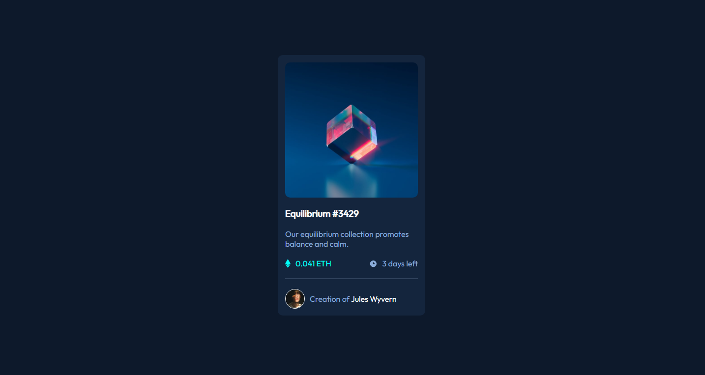

# Frontend Mentor - NFT preview card component solution

This is my solution to the [NFT preview card component challenge on Frontend Mentor](https://www.frontendmentor.io/challenges/nft-preview-card-component-SbdUL_w0U).

## Table of contents

- [Overview](#overview)
  - [The challenge](#the-challenge)
  - [Screenshot](#screenshot)
- [My process](#my-process)
  - [Built with](#built-with)
- [Author](#author)

## Overview

### The challenge

Users should be able to:

- View the optimal layout depending on their device's screen size
- See hover states for interactive elements

### Screenshot



## My process

### Built with

- Semantic HTML5 markup
- CSS3 Styling
- Flexbox

```css
/* Proud of this CSS! */
.container .image-container {
    width: 100%;
    height: 275px;
    border-radius: 10px;
    background-image: url('images/image-equilibrium.jpg');
    background-size: cover;
    background-position: center;
    position: relative;
}

.container .image-container:hover {
    cursor: pointer;
}

.container .image-container:active .image-overlay {
    position: absolute;
    top: 0;
    left: 0;
    width: 100%;
    height: 100%;
    background-image: url('images/icon-view.svg');
    background-size: 50px;
    background-repeat: no-repeat;
    background-position: center;
    background-color: hsl(178, 100%, 50%);
    opacity: 0.6;
    border-radius: 10px;
}

/* I put :active pseudo-selector instead of :hover, so the change of the color text and image overlay appear when you click on the element instead when you hover (when you hover you will se a pointer cursor). */
```

## Author

- Frontend Mentor - [@MladenAntic](https://www.frontendmentor.io/profile/MladenAntic)
